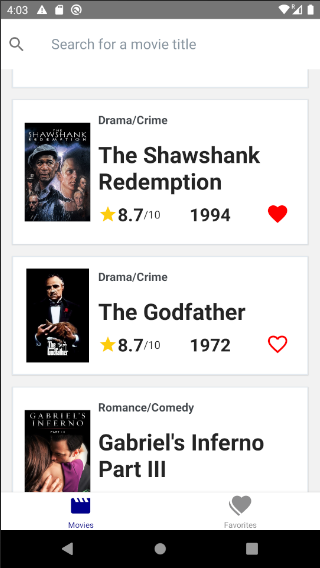
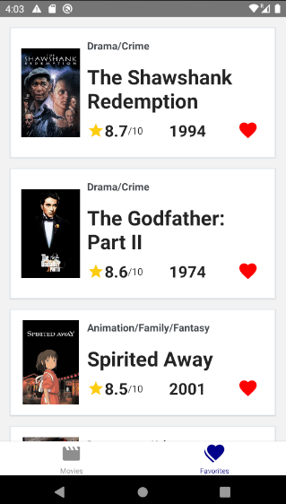
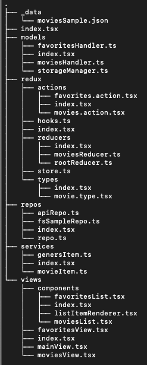

# Screenshots

# Intro

This is my first React-Native application using Typescript - a simple app that fetches movies data and shows top rated movies, allows searching and a Favorites tab.  
The API used for the movies is [The Movie Database API](https://developers.themoviedb.org/3/getting-started/introduction)

# Sources

Here is a list of the sources I used for this application:

1. [React Native Documentation](https://reactnative.dev/docs/getting-started)
2. [Typescript Documentation](https://www.typescriptlang.org/docs/handbook/intro.html)
3. _React Native integration with Redux and TypeScript (Part 1)_, by Leandro Ercoli, 2020, [Link](https://medium.com/@leandroercoli/react-native-integration-with-redux-and-typescript-part-1-6ee1b3da19a0).
4. _Refactoring React class components to Typescript functional components with hooks_, by Benjamin Morali, 2020, [Link](https://medium.com/benextcompany/refactoring-react-class-components-to-typescript-functional-components-with-hooks-a4f42b2bd7b5)

# Folder Structure

All of the code is located in the `./src` folder:

# Main Packages

- [Redux](https://react-redux.js.org/) - for state managment.
- [Redux-Thunk](https://github.com/reduxjs/redux-thunk) - middleware for Redux that basically adds a clouser to our action functions, allowing it to delay the execiton and manage async actions better. I added it because API requests are asynchronous.
- [React Navigation](https://reactnavigation.org/) - for **tab** navigation.
- [React Native Elements](https://reactnativeelements.com/) - for better UI components.
- [React Native Async Storage](https://github.com/react-native-async-storage/async-storage) - for saving/loading key-value pairs in/from the mobile persistent memory.
- [axios](https://github.com/axios/axios) - for managing the requests to the API using _XMLHttpRequests_.

